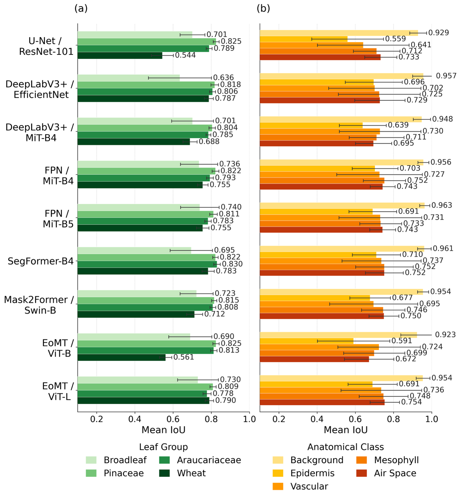

# Phase 1 — Multi-Architecture Benchmark

Benchmark 9 segmentation architectures under the same training settings. The goal is to select the strongest models for later fine-tuning.

---

## Workflow

```
0_compute_class_weights.py       ←  calculate dataset class imbalance
          │
          ▼
1_train_multi_architecture.py    ←  train one selected architecture with --model
          │
          ├── 1.1_SLURM_submit_training.sh  ← helper: submit step 1 to SLURM
          │
          ▼
2_evaluate.py                    ←  evaluate one trained checkpoint
          │
          └── 2.1_run_standard_tests.sh     ← helper: run standard test sets
```

Files with `.1` are helpers for the preceding main step, not separate scientific stages.

---

## Models

| `--model` | Architecture | Paradigm | Encoder / Backbone | Pretraining | Params (M) | Role |
|-----------|--------------|----------|--------------------|-------------|-----------:|------|
| `unet_resnet101` | U-Net | Encoder-decoder | ResNet-101 | ImageNet-1k | 51.51 | CNN baseline |
| `deeplab_efficientnet` | DeepLabV3+ | ASPP | EfficientNet-B4 | ImageNet-1k | 18.62 | CNN paradigm |
| `deeplab_mitb4` | DeepLabV3+ | ASPP | MiT-B4 | ImageNet-1k | 61.99 | Encoder ablation |
| `fpn_mitb4` | FPN | FPN | MiT-B4 | ImageNet-1k | 62.72 | Decoder ablation |
| `fpn_mitb5` | FPN | FPN | MiT-B5 | ImageNet-1k | 83.32 | Scale ablation |
| `segformer` | SegFormer | All-MLP head | MiT-B4 | ADE20K fine-tune | 64.00 | Decoder-free hybrid |
| `mask2former` | Mask2Former | Query-based | Swin-B | ImageNet-21k | 106.88 | Query baseline |
| `eomt_vitb` | EoMT | Query-based | ViT-B/16 | DINOv3 SSL | 92.24 | DINOv3 ViT-B |
| `eomt_vitl` | EoMT | Query-based | ViT-L/16 | DINOv3 SSL | 314.78 | DINOv3 ViT-L |

All models use the same blind Phase 1 settings:
- Augmentation: horizontal flip, vertical flip, rotate +/-45 degrees
- Loss: weighted cross-entropy
- Optimizer: AdamW, lr=1e-4, weight decay=5e-3
- Scheduler: ReduceLROnPlateau, factor=0.5, patience=7
- Patch size: 320 x 320, stride 160
- Epochs: 100 with early stopping patience 15
- Split: species-level split with seed 42

The train/validation split is done at the config/species level, not by randomly mixing individual images. This keeps related images from the same species/sample group together and reduces leakage between training and validation.

Training patches that contain only background are excluded, and patches containing minority classes are oversampled in the training index. Validation patches are extracted without augmentation, oversampling, or background filtering.

---

## Step 0: Class Weights

When the training dataset changes, compute class weights first:

```bash
python 0_compute_class_weights.py
```

By default, this matches `1_train_multi_architecture.py`: same config lists, same seed, same train/val split, and the same 3x pine repeat. It counts only the training side of the species-level split, so validation/test masks do not leak into the class-weight calculation. The script prints a `--class-weights ...` argument that can be passed into training.

---

## Step 1: Train

Direct launch:

```bash
torchrun --standalone --nproc_per_node=4 1_train_multi_architecture.py \
  --model eomt_vitl \
  --class-weights 1.0000 4.1500 3.1000 1.5000 4.6000
```

SLURM launch:

```bash
sbatch -J phase1_eomt_vitl 1.1_SLURM_submit_training.sh eomt_vitl \
  --class-weights 1.0000 4.1500 3.1000 1.5000 4.6000
```

The trainer writes outputs to:

```text
/pscratch/sd/w/worasit/outputs/phase1_clean_<model>/
```

---

## Step 2: Evaluate

Evaluate one trained checkpoint:

```bash
python 2_evaluate.py \
  --model eomt_vitl \
  --checkpoint /pscratch/sd/w/worasit/outputs/phase1_clean_eomt_vitl/best_model.pth \
  --configs /pscratch/sd/w/worasit/configs/test_wheat.json \
  --per_image
```

---

## Step 2.1: Standard Test Helper

Run all standard test sets for one model:

```bash
bash 2.1_run_standard_tests.sh eomt_vitl
```

Run all standard test sets for all benchmark models:

```bash
bash 2.1_run_standard_tests.sh all
```

Outputs:
- `eval_<model>_overall.csv`
- `eval_<model>_per_image.csv`
- optional prediction masks when `--save_predictions` is provided

---

## Benchmark Figure



**Figure. Phase 1 multi-architecture benchmark.** Phase 1: mean Intersection over Union (mIoU) for the screening of nine segmentation architectures. (a) mIoU by held-out evaluation group; (b) mIoU by anatomical class. Error bars represent ± one SD of per-image variability (panel a: n = 16 for Broadleaf and n = 6 each for Pinaceae, Araucariaceae, and Wheat; panel b: n = 34 per architecture).
