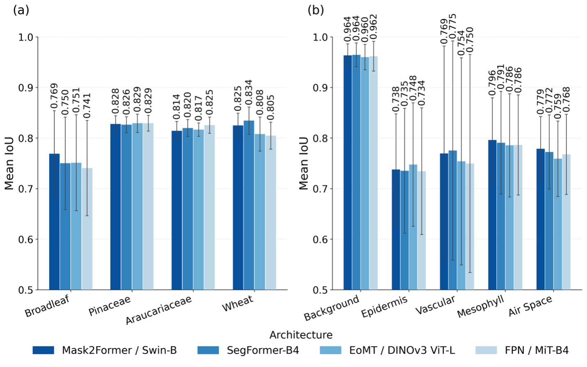

# Phase 2 — Fine-Tuning

Fine-tune the strongest Phase 1 model families with the recipes that produced the best Phase 2 mIoU results.

Phase 1 screened architectures under one shared recipe. Phase 2 keeps the leakage-safe species-level split and patch geometry, then applies the final model-specific training settings used for the best-performing checkpoints.

---

## Workflow

```
Phase 1 benchmark results
          │
          ▼
Select top model families
          │
          ▼
1_train_<model>.py               ←  train one best-result Phase 2 model
          │
          ├── 1.1_SLURM_submit_training.sh  ← helper: submit step 1 to SLURM
          │
          ▼
2_evaluate.py                    ←  evaluate the saved best_model.pth on held-out tests
```

Each training script is self-contained and corresponds to one Phase 2 candidate model.

---

## Models

| Script | Model | Best-result setting | Class weights | Loss |
|--------|-------|---------------------|---------------|------|
| `1_train_mask2former.py` | Mask2Former / Swin-B | Tversky loss to reduce rare-class false positives | `[1.00, 5.00, 4.00, 2.00, 4.60]` | `0.4 CE + 0.4 Tversky + 0.2 Lovasz` |
| `1_train_segformer.py` | SegFormer-B4 | Tversky loss transferred to SegFormer-B4 | `[1.00, 5.00, 3.50, 2.00, 4.60]` | `0.4 CE + 0.4 Tversky + 0.2 Lovasz` |
| `1_train_fpn_mitb4.py` | FPN / MiT-B4 | Increased Mesophyll weighting for improved boundary balance | `[1.00, 5.00, 4.00, 2.50, 4.60]` | `0.4 CE + 0.4 Tversky + 0.2 Lovasz` |
| `1_train_eomt_vitl.py` | EoMT / DINOv3 ViT-L/16 | CLAHE-compatible uint8 augmentation pipeline | `[1.00, 4.15, 3.10, 1.50, 4.60]` | weighted CE |

Shared defaults for the current Phase 2 runs:
- Patch size: 320 x 320
- Stride: 160
- Batch size: 16
- Optimizer: AdamW, lr=1e-4, weight decay=5e-3
- Split: species-level split with seed 42
- Rare-class patch oversampling: classes 1, 2, and 4 at 4x where enabled
- Main Phase 2 augmentation path: uint8 augment first, then normalize

Mask2Former, SegFormer, and FPN use EMA checkpoints with `EMA_DECAY=0.999`. Their `best_model.pth` stores EMA weights in `model_state_dict`, so the Phase 2 evaluator can load them without special handling.

---

## Train

Submit a Phase 2 training run from this folder:

```bash
sbatch -J phase2_mask2former 1.1_SLURM_submit_training.sh mask2former
sbatch -J phase2_segformer 1.1_SLURM_submit_training.sh segformer
sbatch -J phase2_fpn_mitb4 1.1_SLURM_submit_training.sh fpn_mitb4
sbatch -J phase2_eomt_vitl 1.1_SLURM_submit_training.sh eomt_vitl
```

Or launch directly with 4 GPUs:

```bash
torchrun --standalone --nproc_per_node=4 1_train_mask2former.py
torchrun --standalone --nproc_per_node=4 1_train_segformer.py
torchrun --standalone --nproc_per_node=4 1_train_fpn_mitb4.py
torchrun --standalone --nproc_per_node=4 1_train_eomt_vitl.py
```

Files with `.1` are helpers for the preceding main step, not separate scientific stages.

---

## Outputs

Each script writes:

| File | Description |
|------|-------------|
| `best_model.pth` | Lowest validation-loss checkpoint |
| `last_checkpoint.pth` | Resume checkpoint |
| `training_history.csv` | Epoch-level train/validation loss and learning rate |
| `training_log.txt` | Human-readable training log |
| `best_summary.txt` | Best epoch and validation-loss summary |
| `validation_metrics.csv` | Per-class validation precision, recall, and IoU |

Logs are written to the output directory configured in each training script.

---

## Evaluate Held-Out Test Sets

Use the Phase 2 evaluator for the final held-out test sets:

```bash
python 2_evaluate.py \
  --model mask2former \
  --checkpoint /path/to/best_model.pth \
  --configs /pscratch/sd/w/worasit/configs/test_wheat.json \
  --per_image
```

Change `--model`, `--checkpoint`, and `--configs` for the experiment and test group being evaluated. Use the standard Phase 1 test groups for manuscript-level comparisons so Phase 2 remains comparable to the benchmark.

---

## Use the Final Models

The four final fine-tuned Phase 2 models can be found and used through the deployment project:

- **Web app source:** [WorasitSangjan/WebApp-Leaf-microCT-Segmentation](https://github.com/WorasitSangjan/WebApp-Leaf-microCT-Segmentation)
- **Interactive app:** [Leaf CT Segmentation on Hugging Face Spaces](https://huggingface.co/spaces/WorasitSangjan/Leaf-CT-Segmentation)

---

## Fine-Tuning Figure



**Figure. Phase 2 fine-tuning results.** Phase 2: mean Intersection over Union (mIoU) for the four final fine-tuned architectures. (a) mIoU by held-out evaluation group; (b) mIoU by anatomical class. Error bars represent +/- one SD of per-image variability (panel a: n = 16 Broadleaf, n = 6 each for Pinaceae, Araucariaceae, and Wheat; panel b: n = 34 per architecture).

---

## Notes

- The hard-coded config paths assume the NERSC scratch layout under `/pscratch/sd/w/worasit`.
- Phase 2 is best-model selection work. It should be interpreted with held-out mIoU results, not only the internal validation metrics written by each training script.